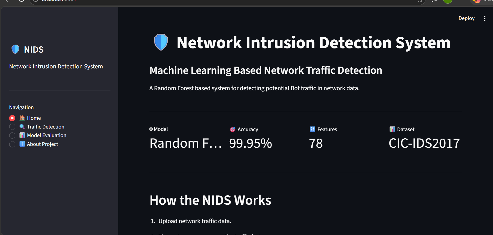
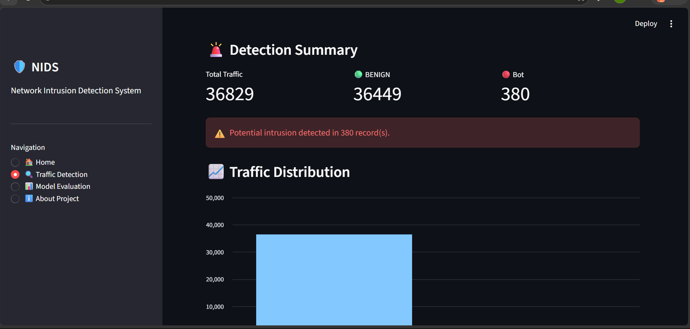
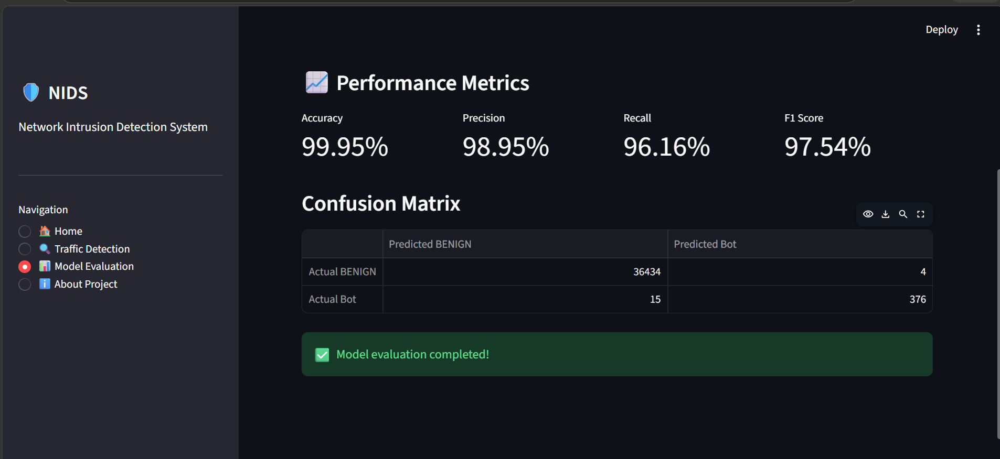

# 🛡️ Network Intrusion Detection System

A machine learning based Network Intrusion Detection System (NIDS)
that classifies network traffic as BENIGN or Bot traffic.

## 📌 Project Overview

This project uses the CIC-IDS2017 network traffic dataset and a
Random Forest machine learning algorithm to detect potentially
malicious Bot traffic.

The project includes data preprocessing, machine learning,
model evaluation, and a Streamlit web dashboard.

## 🛠️ Technologies Used

- Python
- Pandas
- NumPy
- Scikit-learn
- Random Forest
- Streamlit
- Matplotlib
- CIC-IDS2017 Dataset

## 🔄 Project Workflow

Network Traffic Dataset
↓
Data Cleaning
↓
Data Preprocessing
↓
Feature and Label Separation
↓
Random Forest Training
↓
Model Evaluation
↓
Streamlit Dashboard
↓
BENIGN / Bot Detection

## 🤖 Machine Learning Model

Algorithm:

Random Forest Classifier

Number of features:

78

Classes:

- BENIGN
- Bot

## 📊 Model Performance

The Random Forest model achieved:

- Accuracy: 99.95%
- Bot Precision: 99%
- Bot Recall: 96%
- Bot F1-score: 98%

These results are based on the held-out test split from the
CIC-IDS2017 data used in this project.

## 🖥️ Dashboard

The Streamlit dashboard provides:

- CSV network traffic upload
- Traffic classification
- BENIGN traffic count
- Bot traffic count
- Traffic distribution chart
- Prediction results
- Downloadable prediction results
- Model evaluation

## ▶️ How to Run

### 1. Clone the repository

```bash
git clone YOUR_GITHUB_REPOSITORY_URL
## 🖥️ Dashboard Screenshots

### 🏠 Home Dashboard



### 🚨 Traffic Detection



### 📊 Model Evaluation

